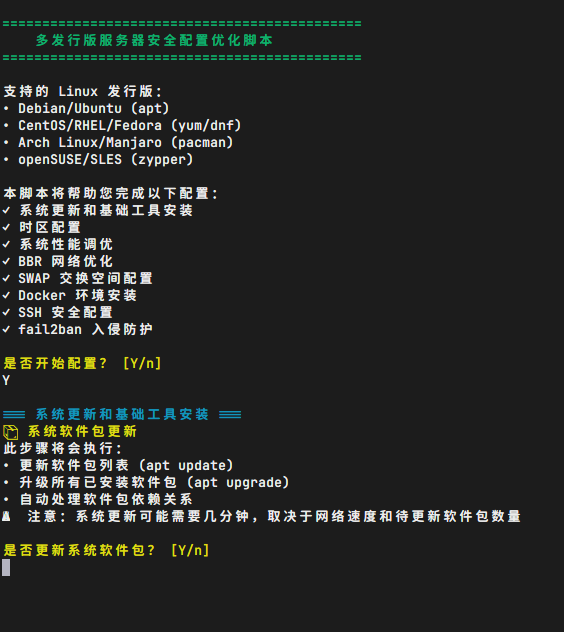

# 多发行版服务器安全配置脚本 / Multi-Distro Server Security Setup Script

[](https://github.com/ShawnMa123/my-server-setup)
[](https://github.com/ShawnMa123/my-server-setup/fork)
[](https://github.com/ShawnMa123/my-server-setup/issues)
[](https://github.com/ShawnMa123/my-server-setup/blob/main/LICENSE)

[English](#english) | [中文](#中文) | [📁 GitHub Repository](https://github.com/ShawnMa123/my-server-setup)



---

## 中文

一个功能强大的多发行版 Linux 服务器安全配置和优化脚本，支持交互式配置，提供详细的操作说明和智能检测功能。

### 🌟 主要特性

- **🐧 多发行版支持** - 自动检测并适配 Debian/Ubuntu/CentOS/Fedora/Arch/openSUSE
- **🎯 交互式配置** - 每个步骤都有详细说明，用户可选择性执行
- **🔍 智能检测** - 自动识别系统类型、包管理器和服务管理器
- **📊 状态显示** - 实时显示配置前后的系统状态变化
- **🛡️ 安全优先** - 内置多重安全检查和警告提醒
- **🌐 网络优化** - 自动选择最佳软件源（国内/海外）

### 📁 文件说明

- `server-setup.sh` - 主要的交互式配置脚本（支持 11 个配置模块）
- `server-setup-guide.md` - 详细的技术配置文档
- `ENHANCED_GUIDE.md` - 增强版功能使用指南


### 🐧 支持的系统

| 发行版系列 | 具体发行版 | 包管理器 | 状态 |
|------------|------------|----------|------|
| **Debian** | Debian, Ubuntu | `apt` | ✅ 完全支持 |
| **Red Hat** | CentOS, RHEL, Fedora, Rocky, AlmaLinux | `yum/dnf` | ✅ 完全支持 |
| **Arch** | Arch Linux, Manjaro | `pacman` | ✅ 完全支持 |
| **SUSE** | openSUSE, SLES | `zypper` | ✅ 完全支持 |

### ⚡ 配置模块

| 模块 | 功能描述 | 建议 | 性能提升 |
|------|----------|------|----------|
| 系统更新 | 更新软件包和安装基础工具 | ✅ 推荐 | 系统安全 |
| 时区配置 | 设置为亚洲/上海时区 | ✅ 推荐 | 日志准确 |
| 系统调优 | 内核参数和网络优化 | ✅ 推荐 | 20-50% 性能提升 |
| BBR 网络 | Google BBR 拥塞控制算法 | ✅ 推荐 | 2-25倍 吞吐量提升 |
| SWAP 配置 | 虚拟内存扩展 | ✅ 推荐 | 防止 OOM |
| Zsh + Oh-My-Zsh | 强大的 Shell 环境 | ✅ 推荐 | 开发效率提升 |
| Node.js LTS | JavaScript 运行时环境 | ✅ 推荐 | 现代化开发 |
| Docker 安装 | 容器化平台部署 | ✅ 推荐 | 现代化部署 |
| SSH 安全 | 端口修改和密钥认证 | ⚠️ 谨慎 | 安全加固 |
| fail2ban | 入侵检测防护系统 | ✅ 推荐 | 自动防护 |

### 🚀 快速开始

#### 1. 下载脚本

```bash
# 克隆整个仓库（推荐）
git clone https://github.com/ShawnMa123/my-server-setup.git
cd my-server-setup

# 或者直接下载脚本文件
wget -O server-setup.sh https://raw.githubusercontent.com/ShawnMa123/my-server-setup/main/server-setup.sh

# 使用 curl
curl -o server-setup.sh https://raw.githubusercontent.com/ShawnMa123/my-server-setup/main/server-setup.sh
```

#### 2. 设置权限并运行

```bash
chmod +x server-setup.sh
sudo ./server-setup.sh
```

#### 3. 交互式配置

脚本会逐步询问每个配置模块，用户可以根据需要选择：

- 每个步骤都有详细的功能说明
- 显示将要安装的软件包列表
- 展示预期的性能提升效果
- 提供安全警告和注意事项

### 💻 完整使用示例

```bash
# 1. 克隆仓库
git clone https://github.com/ShawnMa123/my-server-setup.git
cd my-server-setup

# 2. 运行脚本
sudo chmod +x server-setup.sh
sudo ./server-setup.sh

# 脚本将显示类似以下的交互界面：
# =============================================
#     多发行版服务器安全配置优化脚本
# =============================================
# 支持的 Linux 发行版：
# • Debian/Ubuntu (apt)
# • CentOS/RHEL/Fedora (yum/dnf)
# ...
# 检测到系统: debian-based (apt)
# 服务管理器: systemctl
#
# 📦 系统软件包更新
# 此步骤将会执行：
# • 更新软件包列表 (apt update)
# • 升级所有已安装软件包 (apt upgrade)
# ...
# 是否更新系统软件包？ [Y/n]
```

### 🎨 界面特性

- **🔵 蓝色** - 信息提示和步骤说明
- **🟢 绿色** - 成功完成和正面反馈
- **🟡 黄色** - 警告信息和注意事项
- **🔴 红色** - 错误信息和失败提示
- **📊 数据展示** - 实时显示系统状态和配置结果

### 📋 系统要求

- **操作系统**: Linux (内核 3.10+)
- **权限**: root 或 sudo 权限
- **网络**: 稳定的互联网连接
- **磁盘**: 至少 1GB 可用空间
- **内存**: 建议 512MB 以上

### 🔧 故障排除

#### 权限问题

```bash
# 切换到 root 用户
sudo su -
./server-setup.sh
```

#### 网络连接测试

```bash
# 测试 GitHub 连接
curl -I https://raw.githubusercontent.com

# 测试 Docker 官方源
curl -I https://get.docker.com
```

#### 系统兼容性检查

```bash
# 查看系统信息
cat /etc/os-release
uname -a

# 检查包管理器
which apt yum dnf pacman zypper 2>/dev/null
```

### 🛡️ 安全建议

- ⚠️ **测试环境** - 建议先在测试环境中运行
- 🔑 **SSH 配置** - 修改 SSH 端口前确保防火墙规则正确
- 💾 **配置备份** - 重要配置文件建议提前备份
- 🔒 **密钥保存** - SSH 密钥配置后请妥善保存私钥


---

## English

A powerful multi-distribution Linux server security configuration and optimization script with interactive setup and detailed explanations.

### 🌟 Key Features

- **🐧 Multi-Distro Support** - Auto-detects and adapts to Debian/Ubuntu/CentOS/Fedora/Arch/openSUSE
- **🎯 Interactive Configuration** - Detailed explanations for each step with selective execution
- **🔍 Intelligent Detection** - Auto-identifies system type, package manager, and service manager
- **📊 Status Display** - Real-time display of system status changes before and after configuration
- **🛡️ Security-First** - Built-in multiple security checks and warning alerts
- **🌐 Network Optimization** - Auto-selects optimal software sources (domestic/international)

### 📁 File Structure

- `server-setup.sh` - Main interactive configuration script (supports 11 configuration modules)
- `server-setup-guide.md` - Detailed technical configuration documentation
- `ENHANCED_GUIDE.md` - Enhanced feature usage guide


### 🐧 Supported Systems

| Distribution Family | Specific Distributions | Package Manager | Status |
|---------------------|------------------------|-----------------|--------|
| **Debian** | Debian, Ubuntu | `apt` | ✅ Fully Supported |
| **Red Hat** | CentOS, RHEL, Fedora, Rocky, AlmaLinux | `yum/dnf` | ✅ Fully Supported |
| **Arch** | Arch Linux, Manjaro | `pacman` | ✅ Fully Supported |
| **SUSE** | openSUSE, SLES | `zypper` | ✅ Fully Supported |

### ⚡ Configuration Modules

| Module | Description | Recommendation | Performance Gain |
|--------|-------------|----------------|------------------|
| System Update | Update packages and install basic tools | ✅ Recommended | System Security |
| Timezone Setup | Set to Asia/Shanghai timezone | ✅ Recommended | Log Accuracy |
| System Tuning | Kernel parameters and network optimization | ✅ Recommended | 20-50% Performance Boost |
| BBR Network | Google BBR congestion control algorithm | ✅ Recommended | 2-25x Throughput Improvement |
| SWAP Config | Virtual memory extension | ✅ Recommended | OOM Prevention |
| Zsh + Oh-My-Zsh | Powerful shell environment | ✅ Recommended | Development Efficiency |
| Node.js LTS | JavaScript runtime environment | ✅ Recommended | Modern Development |
| Docker Install | Containerization platform deployment | ✅ Recommended | Modern Deployment |
| SSH Security | Port modification and key authentication | ⚠️ Caution | Security Hardening |
| fail2ban | Intrusion detection and protection system | ✅ Recommended | Automatic Protection |

### 🚀 Quick Start

#### 1. Download Script

```bash
# Clone the entire repository (recommended)
git clone https://github.com/ShawnMa123/my-server-setup.git
cd my-server-setup

# Or download the script file directly
wget -O server-setup.sh https://raw.githubusercontent.com/ShawnMa123/my-server-setup/main/server-setup.sh

# Using curl
curl -o server-setup.sh https://raw.githubusercontent.com/ShawnMa123/my-server-setup/main/server-setup.sh
```

#### 2. Set Permissions and Run

```bash
chmod +x server-setup.sh
sudo ./server-setup.sh
```

#### 3. Interactive Configuration

The script will step-by-step ask about each configuration module, users can choose as needed:

- Detailed functional descriptions for each step
- Display list of packages to be installed
- Show expected performance improvement effects
- Provide security warnings and precautions

### 🎨 Interface Features

- **🔵 Blue** - Information prompts and step descriptions
- **🟢 Green** - Successful completion and positive feedback
- **🟡 Yellow** - Warning information and precautions
- **🔴 Red** - Error messages and failure prompts
- **📊 Data Display** - Real-time system status and configuration results

### 📋 System Requirements

- **Operating System**: Linux (Kernel 3.10+)
- **Permissions**: root or sudo privileges
- **Network**: Stable internet connection
- **Disk**: At least 1GB available space
- **Memory**: 512MB+ recommended

### 🔧 Troubleshooting

#### Permission Issues

```bash
# Switch to root user
sudo su -
./server-setup.sh
```

#### Network Connection Test

```bash
# Test GitHub connectivity
curl -I https://raw.githubusercontent.com

# Test Docker official source
curl -I https://get.docker.com
```

#### System Compatibility Check

```bash
# View system information
cat /etc/os-release
uname -a

# Check package managers
which apt yum dnf pacman zypper 2>/dev/null
```

### 🛡️ Security Recommendations

- ⚠️ **Test Environment** - Recommend running in test environment first
- 🔑 **SSH Configuration** - Ensure firewall rules are correct before modifying SSH port
- 💾 **Configuration Backup** - Backup important configuration files in advance
- 🔒 **Key Storage** - Securely save private keys after SSH key configuration

---

### 📊 Performance Benchmarks

After using this script, your server will achieve:

- **Network Performance**: 20-50% throughput improvement
- **Memory Efficiency**: SWAP support, OOM prevention
- **Security Protection**: fail2ban intrusion detection
- **Container Ready**: Docker environment ready
- **System Stability**: Comprehensive parameter optimization


---

*Please carefully read the script content before use to ensure you understand the purpose and risks of each configuration.*
